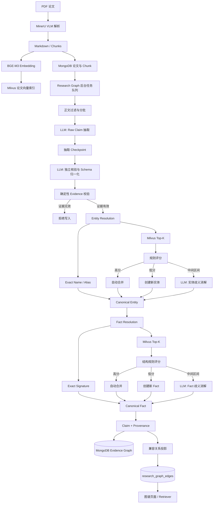
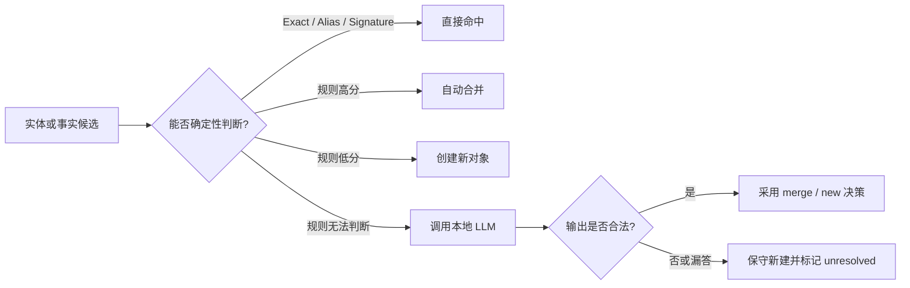
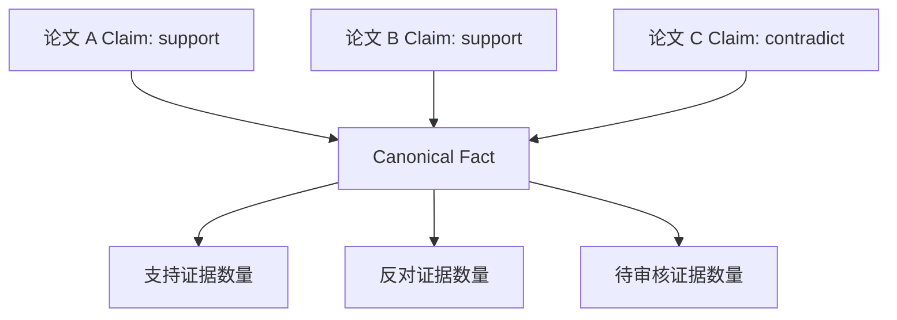
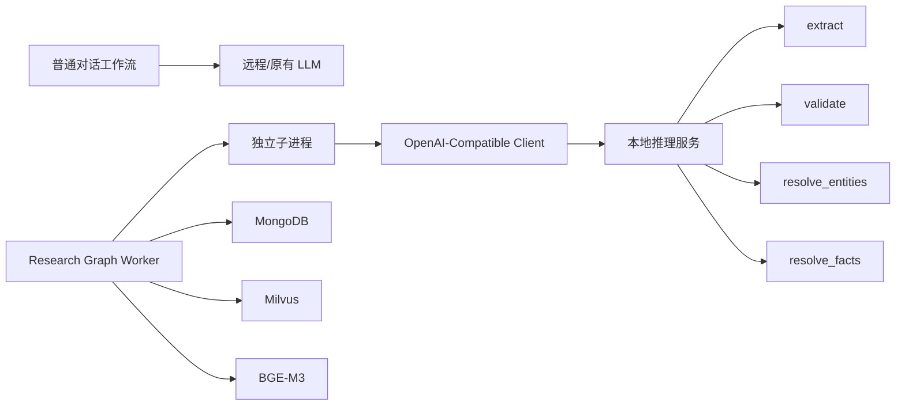

# Paper Agent 知识图谱技术总结与本地大模型接入方案

> 适用范围：Paper Agent 当前的 Evidence Graph V4。
>
> 本文聚焦知识图谱的技术点、系统架构、数据流、现有痛点，以及将图谱 LLM 单独切换为本地部署模型时的接入边界。

## 1. 总体结论

Paper Agent 的知识图谱不是简单的“实体—关系—实体”三元组，而是一套带证据、可追溯、可审核、可增量恢复的学术事实图谱。

核心设计为：

```text
Paper → Raw Claim → Verified Claim → Canonical Entity → Fact → Provenance
```

其中：

- **Claim** 表示某篇论文在具体原文证据中做出的陈述。
- **Canonical Entity** 负责将缩写、别名、复数形式等统一到稳定实体。
- **Fact** 负责将不同论文中语义相同的 Claim 聚合到同一个高层事实。
- **Provenance** 保存论文、章节、页码、Chunk、原文证据及版本信息。
- **Review Status** 支持自动核验、待审核、人工确认和人工拒绝。

接入本地模型时，不需要让模型接管整个知识图谱。模型只负责四类语义慢路径：

1. 学术事实抽取；
2. 事实核验与 Schema 归一化；
3. 模糊实体消歧；
4. 模糊事实消歧。

精确匹配、规则评分、向量召回、证据定位、ID 生成、数据库写入和任务恢复继续由确定性代码完成。

---

## 2. 系统架构图



---

## 3. Fast Path 与 Slow Path



### 3.1 Fast Path

Fast Path 不调用 LLM，主要包括：

- Canonical Entity 名称精确匹配；
- Entity Alias 精确匹配；
- Fact Signature 精确匹配；
- BGE-M3 向量生成；
- Milvus Top-K 候选召回；
- 名称、缩写、上下文和结构规则评分；
- Evidence 是否逐字存在于原 Chunk 的校验；
- Claim、Fact、Entity ID 和 Hash 生成；
- Claim/Fact 计数与数据库写入。

### 3.2 Slow Path

Slow Path 才调用大模型：

| 调用模式 | 作用 | 是否固定调用 |
|---|---|---|
| `extract` | 从正文中抽取原始事实候选 | 每个正文批次一次 |
| `validate` | 独立核验、类型归一化、关系映射 | 每个候选批次一次 |
| `resolve_entities` | 处理规则无法确定的实体 | 仅有模糊实体时调用 |
| `resolve_facts` | 处理规则无法确定的事实 | 仅有模糊 Fact 时调用 |

因此，单个批次的基础成本是两次 LLM 调用：抽取一次、核验一次。Entity/Fact Resolution 只有出现歧义候选时才额外调用。

---

## 4. 核心技术点

### 4.1 全文分段与批处理

- 排除 `References`、`Bibliography`、`参考文献` 等章节；
- 长 Chunk 按换行、英文句号和中文标点切分；
- 默认单个 Segment 最大约 4000 字符；
- 默认单个 Batch 最大约 12000 字符；
- 保留 `chunk_index`、`segment_index`、heading 和 page；
- 请求超过预算时继续递归拆批，不发送理论上无法完成的超大请求。

### 4.2 两阶段事实生成

第一阶段只抽取原始事实：

```json
{
  "subject_name": "PINN",
  "predicate_raw": "is used to solve",
  "object_name": "Navier-Stokes equations",
  "evidence_chunk_index": 12,
  "evidence": "逐字复制的原文证据"
}
```

第二阶段负责核验和 Schema 归一化：

```json
{
  "candidate_index": 0,
  "verdict": "supported",
  "valid": true,
  "subject_name": "PINN",
  "subject_type": "model",
  "predicate": "SOLVES",
  "object_name": "Navier-Stokes equations",
  "object_type": "equation",
  "qualifiers": {},
  "stance": "support",
  "confidence": 0.93,
  "reason": "原文明确支持该关系"
}
```

两阶段分离的意义：

- 避免同一个模型在抽取时同时完成过多任务；
- 用第二次调用检查第一次抽取是否误读；
- 集中完成实体类型、Predicate、Qualifier 和 Stance 归一化；
- 避免增加第三次独立 Normalization 调用。

### 4.3 固定实体类型

当前实体类型为闭集：

```text
method
model
algorithm
dataset
problem
task
equation
software
metric
domain
```

模型不得发明新类型。非法类型会导致 Claim 无效。

### 4.4 固定 Predicate

当前 Canonical Predicate 为：

```text
USES_METHOD
USES_MODEL
USES_DATASET
USES_SOFTWARE
SOLVES
EVALUATED_BY
IMPROVES
OUTPERFORMS
COMPARES_WITH
EXTENDS
BASED_ON
UNKNOWN
```

自由关系短语只能在核验阶段映射到上述集合。无法可靠映射时使用 `UNKNOWN`，且不会形成可用 Fact。

### 4.5 Claim 与 Fact 分层

Claim 表示单篇论文中的具体陈述；Fact 表示跨论文聚合后的事实。



冲突 Claim 不会覆盖已有 Claim，而是通过 `stance=contradict` 指向同一个 Fact。

Fact 的稳定签名为：

```text
subject_entity_id | predicate | object_entity_id
```

Qualifier 第一版只保留在 Claim 中，不进入 Fact Signature。

### 4.6 Entity Resolution

实体消歧采用渐进式策略：

1. 同类型下按标准化名称或 Alias 精确匹配；
2. 未命中时生成 BGE-M3 Embedding；
3. 从 Milvus 按实体类型召回 Top-8；
4. 同时使用 MongoDB blocking key 召回候选；
5. 综合名称、缩写、向量相似度和上下文评分；
6. 只有中间分数候选进入 LLM。

规则阈值：

| 分数 | 动作 |
|---|---|
| `>= 0.88` | 自动合并 |
| `< 0.55` | 创建新实体 |
| `0.55～0.88` | LLM 歧义消解 |

规则评分权重：

```text
0.55 × 名称相似度
+ 0.30 × Embedding 相似度
+ 0.15 × 上下文词重合度
```

相同缩写或精确 Alias 可以直接获得高分，但禁止跨类型合并。

### 4.7 Fact Resolution

Entity Resolution 完成后才进行 Fact Resolution：

1. 构造 Fact Signature；
2. Signature 精确命中则直接复用；
3. 未命中时在 Milvus 中按 Predicate 召回 Top-8；
4. 根据 Subject、Predicate、Object 和 Embedding 进行结构评分；
5. 中间分数候选才进入 LLM。

规则阈值：

| 分数 | 动作 |
|---|---|
| `>= 0.90` | 自动合并 |
| `< 0.60` | 创建新 Fact |
| `0.60～0.90` | LLM 歧义消解 |

Fact Resolution 中 Embedding 只用于召回和弱辅助，不允许单独决定合并。

### 4.8 Evidence 与 Provenance

每条 Claim 必须保存：

- `paper_id`；
- `chunk_id` / `chunk_index`；
- `section`；
- `page`；
- `evidence`；
- `evidence_context`；
- `evidence_content_hash`；
- `confidence`；
- `extractor_version`；
- `verifier_version`；
- `entity_resolver_version`；
- `fact_resolver_version`；
- `graph_version`。

写入前执行确定性校验：

```text
normalize(evidence) 必须是 normalize(chunk.content) 的子串
```

这一步是防止模型生成“语义正确但原文不存在”的伪证据的最后防线。

### 4.9 审核状态

主要状态包括：

| 状态 | 含义 |
|---|---|
| `auto_verified` | 模型核验为 supported，且确定性证据校验通过 |
| `needs_review` | 模型返回 uncertain 或解析结果不完整 |
| `confirmed` | 人工确认 |
| `rejected` | 人工拒绝 |

重新抽取论文时，已有人工 `confirmed/rejected` 状态会保留。

### 4.10 MongoDB + Milvus 双存储

MongoDB 保存：

- Paper；
- Canonical Entity；
- Alias；
- Claim；
- Fact；
- Resolution Cache；
- 后台 Job、Checkpoint 和调度状态；
- 页面与 Retriever 使用的兼容 Edge。

Milvus 保存：

- `kg_entity_embeddings`；
- `kg_fact_embeddings`。

向量库只负责候选召回，MongoDB 中的 Canonical 数据才是事实来源。

### 4.11 增量更新

- 新论文只处理自身的 Chunks、Mentions、Claims 和 Provenance；
- 只读取已有 Canonical 数据的 Top-K 候选；
- 不扫描或重建整个论文库；
- 新结果全部完成后再替换该论文旧的系统生成 Claim；
- 只重新计算受影响 Fact 的计数。

### 4.12 后台任务可靠性

图谱任务具备：

- 独立子进程调用 LLM；
- 硬超时后终止子进程；
- MongoDB Lease 和 Heartbeat；
- 按论文、按 Batch 保存进度；
- 抽取阶段独立 Checkpoint；
- 核验失败后不重复抽取；
- Worker 中断后的 Lease 回收；
- 有界业务重试；
- TPM 429 持久化退避；
- 全局 Circuit Breaker；
- 过大 Payload 自动拆分；
- 上传队列优先、图谱任务低优先级执行。

---

## 5. 当前遇到的痛点

### 5.1 图谱模型与主对话模型配置耦合

当前虽然存在独立的 `get_graph_llm()`，但图谱仍读取：

```text
LLM_MODEL
LLM_BASE_URL
LLM_API_KEY
```

结果是：

- 无法单独给图谱切换本地模型；
- 修改图谱模型会同时影响 Supervisor、Analyzer、Presenter 等 Agent；
- 图谱吞吐、成本和稳定性无法独立治理；
- 无法针对结构化抽取任务选择更合适的模型。

### 5.2 严格 JSON 输出不稳定

常见问题：

- 输出带 Markdown 代码围栏；
- 在 JSON 前后附加解释；
- 输出 Token 不足导致数组截断；
- 返回空正文；
- 数组中混入非对象元素；
- 字段名不一致；
- 核验阶段漏回部分 `candidate_index`；
- 重复返回同一个候选且判断冲突。

当前系统已经实现部分 JSON 恢复和逐项降级，但仍会增加重试和人工审核量。

### 5.3 Evidence 容易被模型改写

模型经常返回语义等价、但不是原文逐字复制的证据。

影响：

- 无法通过确定性子串校验；
- 正确事实也会被拒绝；
- Provenance 不可信；
- 页面无法精确回溯原文。

### 5.4 “本文贡献”与“相关工作”混淆

学术论文会大量描述其他论文、引用工作和基线方法。模型可能把：

- Related Work 中的描述；
- 引用论文的结论；
- 背景知识；
- 单纯提及的数据集或方法；

误判成当前论文自己的 Claim。

这也是抽取后必须再执行独立核验的主要原因。

### 5.5 Schema 映射有信息损失

固定 Predicate 有利于检索和聚合，但会产生以下问题：

- 原始关系粒度高于现有 Predicate；
- `EXTENDS`、`BASED_ON`、`USES_METHOD` 之间可能存在边界歧义；
- 无法稳定映射的关系只能进入 `UNKNOWN`；
- `UNKNOWN` 不会形成可用 Fact；
- Legacy Relation 投影会进一步压缩语义。

### 5.6 实体消歧存在错误合并与重复实体的权衡

- 合并阈值过低：不同实体可能被错误合并；
- 合并阈值过高：别名会变成多个重复实体；
- 学术缩写存在一词多义；
- 同一名称可能在不同领域代表不同概念；
- Embedding 相似不等于实体相同。

当前策略优先避免错误合并：LLM 失败时保守创建新实体，而不是强制合并。

### 5.7 Fact Signature 暂不包含 Qualifier

当前签名只有：

```text
subject | predicate | object
```

因此以下两条 Claim 可能聚合到同一个 Fact：

```text
模型 A 在数据集 X 上优于模型 B
模型 A 在数据集 Y 上优于模型 B
```

差异会保留在 Claim 的 Qualifier 中，但 Fact 层不能直接表达条件化差异。

### 5.8 长论文的调用量和吞吐压力

- 全文会被拆成多个 Batch；
- 每个 Batch 至少两次 LLM 调用；
- 候选过多时核验会再次拆分；
- 实体和 Fact 存在歧义时还会追加调用；
- 本地模型推理速度可能成为整个后台队列瓶颈。

### 5.9 远程模型 TPM 与限流

历史问题包括：

- `429001 inference tpm exhausted`；
- 临时限流被误算为论文业务失败；
- 多个任务继续撞击共享额度；
- 核验限流后重复执行已经完成的抽取。

当前已经通过持久化退避、全局暂停和抽取 Checkpoint 解决主要恢复问题。本地部署后虽然没有供应商 TPM，但仍需要控制显存、并发和上下文长度。

### 5.10 模型评估不能只看抽取数量

关系数量高不代表质量高。真正需要关注的是：

- 错误事实率；
- 错误实体合并率；
- 重复实体率；
- Evidence 精确匹配率；
- JSON 协议成功率；
- Provenance 完整率；
- 人工审核通过率；
- 单篇处理耗时与显存峰值。

---

## 6. 本地大模型接入架构



### 6.1 推荐配置隔离

新增独立配置：

```dotenv
GRAPH_LLM_MODEL=your-local-model
GRAPH_LLM_BASE_URL=http://127.0.0.1:8000/v1
GRAPH_LLM_API_KEY=local
```

保留原有配置作为默认回退：

```python
GRAPH_LLM_MODEL = os.getenv("GRAPH_LLM_MODEL", LLM_MODEL)
GRAPH_LLM_BASE_URL = os.getenv("GRAPH_LLM_BASE_URL", LLM_BASE_URL)
GRAPH_LLM_API_KEY = os.getenv("GRAPH_LLM_API_KEY", LLM_API_KEY)
```

隔离后：

```text
Supervisor / Analyzer / Presenter → 原有 LLM
Knowledge Graph 四类调用       → 本地 LLM
```

### 6.2 API 兼容要求

当前代码使用 `ChatOpenAI`，因此本地服务最好提供 OpenAI-compatible Chat Completions API：

```http
POST /v1/chat/completions
```

最低要求：

- 支持 `model`；
- 支持 `messages`；
- 支持 `temperature=0`；
- 支持最大输出 Token 参数；
- 返回正文位于 `choices[0].message.content`；
- 错误时返回明确 HTTP 状态和错误正文。

### 6.3 模型能力要求

本地模型应优先满足：

- 中英文科研文本理解；
- 严格 JSON 输出；
- 原文逐字 Evidence 抽取；
- 区分本文工作、相关工作和引用内容；
- 遵守闭集 Entity Type 与 Predicate；
- 稳定处理数组型批量任务；
- `temperature=0` 下结果可复现；
- 上下文至少 16K，推荐 32K；
- 支持约 2K 或更高输出 Token；
- 不把思维过程写入最终 JSON。

模型选型应优先考察结构化输出稳定性，而不是开放式对话能力。

### 6.4 本地资源控制

建议：

- 单 GPU 默认保持一个图谱 Worker；
- 图谱任务继续在上传队列空闲时执行；
- 根据本地推理速度提高图谱调用超时；
- `GRAPH_JOB_LEASE_SECONDS` 必须长于硬超时；
- 如果不需要 TPM 预留，可将 `GRAPH_LLM_TPM_LIMIT=0`；
- 保留 Payload 拆批逻辑，防止上下文溢出或显存不足；
- 保留子进程隔离，保证模型请求卡死时可以强制终止。

---

## 7. 本地模型输入输出契约

### 7.1 `extract`

输入：

```json
{
  "mode": "extract",
  "paper": {
    "arxiv_id": "paper-id",
    "title": "Paper Title"
  },
  "batch": [
    {
      "chunk_index": 0,
      "segment_index": 0,
      "heading": "Method",
      "page": 3,
      "content": "paper text"
    }
  ]
}
```

输出要求：

```json
{
  "ok": true,
  "candidates": [
    {
      "subject_name": "...",
      "predicate_raw": "...",
      "object_name": "...",
      "evidence_chunk_index": 0,
      "evidence": "..."
    }
  ]
}
```

### 7.2 `validate`

输入包含论文、候选相关正文和候选数组。

输出必须为每个候选返回唯一 `candidate_index`，并产生：

```text
verdict
valid
subject_name / subject_type
predicate
object_name / object_type
qualifiers
stance
confidence
reason
```

### 7.3 `resolve_entities`

模型只能：

- 从给定候选中选择 `merge`；或
- 返回 `new`。

不得生成候选列表之外的 `entity_id`。

### 7.4 `resolve_facts`

模型只能：

- 从给定候选中选择 `merge`；或
- 返回 `new`。

不得生成候选列表之外的 `fact_id`。

---

## 8. 推荐实施步骤

### 阶段一：配置隔离

1. 增加 `GRAPH_LLM_MODEL`；
2. 增加 `GRAPH_LLM_BASE_URL`；
3. 增加 `GRAPH_LLM_API_KEY`；
4. `get_graph_llm()` 只读取图谱专属配置；
5. 未配置时回退到原有 `LLM_*`。

### 阶段二：协议验证

依次验证：

1. 本地服务连接；
2. 空数组输出；
3. 单候选抽取；
4. 多候选抽取；
5. 核验逐项完整返回；
6. 实体 merge/new；
7. Fact merge/new；
8. 超时、空正文和非法 JSON。

### 阶段三：小规模回归

选择 20～50 篇覆盖不同领域、篇幅和排版的论文，建立人工抽样基准。

重点对比：

| 指标 | 说明 |
|---|---|
| JSON 成功率 | 不需要重试即可解析的比例 |
| Evidence 匹配率 | Evidence 能在原 Chunk 中精确定位的比例 |
| Claim 准确率 | 抽取事实是否被原文支持 |
| Schema 合法率 | 类型和 Predicate 是否都在闭集内 |
| Entity 错误合并率 | 不同实体被合并的比例 |
| Entity 重复率 | 同一实体被拆成多个 Canonical Entity 的比例 |
| Fact 错误合并率 | 不同事实被聚合的比例 |
| Provenance 完整率 | Claim 是否拥有完整出处 |
| Needs Review 比例 | 需要人工确认的 Claim 占比 |
| 单篇耗时 | 从 Job 开始到完成的总时间 |
| 显存峰值 | 本地部署的最大显存占用 |

### 阶段四：灰度替换

1. 保留原模型作为回退；
2. 只让新入库论文使用本地模型；
3. 不立即重建全部历史论文；
4. 观察失败率、队列长度和审核通过率；
5. 指标稳定后再低优先级回填历史数据。

---

## 9. 验收标准

本地模型接入成功至少应满足：

- 普通对话模型配置不受影响；
- 四种图谱模式全部走本地服务；
- JSON 输出可以被现有解析器稳定消费；
- Evidence 必须能在原 Chunk 中定位；
- 非法类型和 `UNKNOWN` 不形成可用 Fact；
- Exact/Alias/Signature 命中不调用 LLM；
- LLM 漏答不会导致整篇论文任务失败；
- 模型异常不会产生候选列表外的实体或 Fact 合并；
- 超时后子进程可以终止；
- Worker 重启后可以从 Checkpoint 继续；
- 人工审核状态不会被重新抽取覆盖；
- 兼容图谱页面和 Retriever 无需修改即可继续工作。

---

## 10. 风险与应对

| 风险 | 影响 | 应对方式 |
|---|---|---|
| 本地模型 JSON 不稳定 | 批次失败或大量重试 | 使用严格提示词、JSON Schema/受约束解码、保留解析恢复 |
| Evidence 被改写 | Claim 被确定性校验拒绝 | 强调逐字复制，增加 Evidence 专项评测 |
| 上下文不足 | 长 Batch 截断或遗漏 | 保留自动拆批，优先使用 16K/32K 上下文 |
| 推理速度慢 | 图谱队列积压 | 单独监控队列，按资源调整 Batch 和超时 |
| 显存不足 | 服务崩溃 | 单 Worker、量化、限制上下文和输出长度 |
| 实体错误合并 | 污染所有后续 Fact | 保持高置信规则阈值，失败时保守新建 |
| 重复实体过多 | 检索和聚合质量下降 | 优化 Alias、缩写规则和离线评测集 |
| Predicate 粒度不足 | 信息损失 | 先保留 `predicate_raw`，通过版本升级扩展 Schema |
| Qualifier 未进入 Fact 签名 | 条件不同的 Claim 被聚合 | 在查询层展示 Qualifier，后续评估条件化 Fact |

---

## 11. 最终建议

推荐保持当前“规则优先、LLM 处理歧义、证据必须可验证”的架构，不把知识图谱整体改成端到端大模型生成。

本地模型的最佳定位是：

```text
受确定性管线约束的学术语义判断器
```

而不是：

```text
负责生成并直接写入知识图谱的黑盒模型
```

优先完成图谱模型配置隔离，再围绕四种模式建立稳定的 JSON 和 Evidence 回归集。模型选型时应把结构化输出成功率、Evidence 精确匹配率和错误合并率放在参数规模与开放式生成能力之前。
